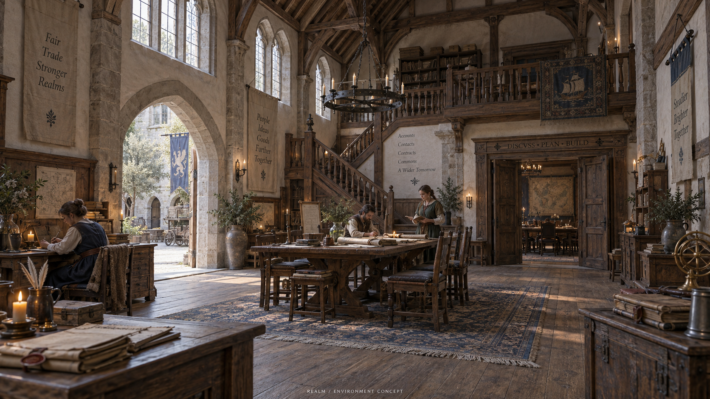
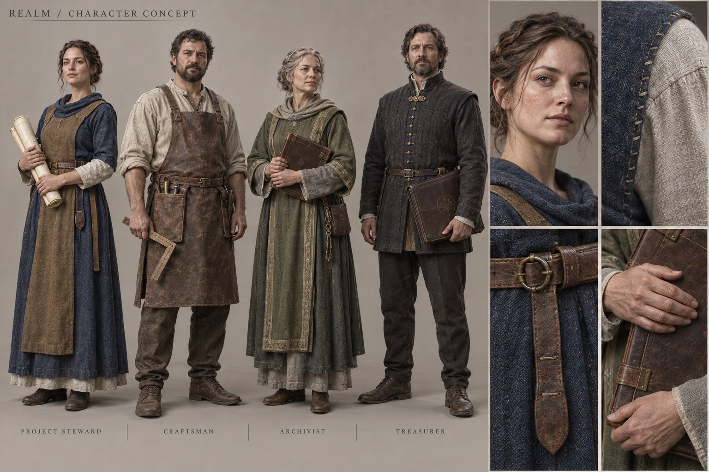
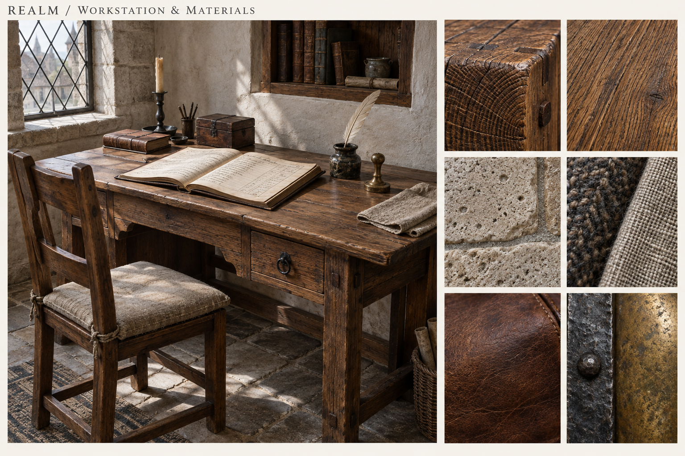

# Realm — Medieval Workplace / Art Direction v2

Ngày: 12/09/2026 · Trạng thái: **Thiết kế đề xuất để review**

Quyết định của chủ sản phẩm: **chốt hình ảnh trước, chưa quyết định engine**. Bộ này không chuyển ứng dụng sang Unreal Engine, không thay renderer và không chứng nhận chất lượng AAA. Ảnh là concept tạo bằng công cụ image_gen tích hợp, không phải ảnh chụp ứng dụng hoặc model 3D đã dựng.

[Mở design board](./index.html) · [Prompt gốc](./PROMPTS.json) · [36 rule nghiệm thu chất lượng](../../REALM-AAA-ACCEPTANCE-RULES-V1.md) · [Bảng theo dõi nghiệm thu](../../REALM-AAA-RULES-TRACKER-V1.csv)

## 1. Hướng thiết kế

**Một hội quán thương nghiệp cuối thời Trung cổ, được chăm sóc và đang hoạt động.** Người dùng phải muốn ở đây làm việc nhiều giờ: ánh sáng đủ đọc, bàn ghế vừa người, có nơi tập trung và nơi trao đổi. Cảm giác cao cấp đến từ hình khối, chất liệu, ánh sáng và chuyển động nhất quán.

Nền tham chiếu sáng tạo: Tây Bắc châu Âu cuối thời Trung cổ, khoảng thế kỷ XV. Đây là thế giới hư cấu có chủ đích, chưa phải tái dựng lịch sử được thẩm định. Trang phục và cấu kiện cần bảng tham chiếu hiện vật riêng khi sản xuất. Những chi tiết không đúng thời kỳ trong concept không tự động trở thành chuẩn.

Ba nguyên tắc: **người thật — vật liệu thật — công việc thật**. Giảm trang trí không có công năng; không lấy bụi bẩn, bóng tối hoặc số lượng vật thể làm thước đo chân thực. Fantasy được tiết chế trong huy hiệu và nghi thức, không dùng neon, đồ vật bay hoặc giáp chiến đấu để thay thế thiết kế nghề nghiệp.

So với bible v1: hướng cơ sở chuyển từ adult stylized realism sang realistic adult proportions; camera chính chuyển sang góc nhìn người và theo vai, không còn ràng buộc một camera orthographic. Các họ elf/dwarf/half-orc/tiefling vẫn được lưu trong v1 để phát triển sau; bốn nhân vật người trong bộ này là mẫu chuẩn chung, không phải quyết định xóa hệ tùy biến. Contract trạng thái công việc, quyền, presence, voice và receipt vẫn giữ nguyên.

## 2. Môi trường và kiến trúc

Hội quán có khối chính khoảng **18 × 26 m**, làm mốc blockout chứ không phải bản vẽ thi công. Một sảnh làm việc chung nối các phòng bên; sân trong đưa ánh sáng và chiều sâu vào không gian. Tầng lửng chỉ mở rộng kho sách và góc ngồi, không đặt chức năng bắt buộc chỉ ở cầu thang. Luôn có đi thẳng tới khu cần dùng.

| Thành phần | Thiết kế bắt buộc |
| --- | --- |
| Kết cấu | Trụ đá có bệ và điểm nhận dầm; dầm sồi có mộng, chốt, phương thớ; mái thật có chiều dày. Không đặt dầm trang trí xuyên cửa. |
| Tường | Đá tập trung ở kết cấu và chân tường; vữa vôi sáng ở mảng lớn, tránh toàn bộ căn phòng thành hang đá. |
| Cửa sổ | Kính ghép ô có độ dày và khung thật; hốc cửa tạo chiều sâu; đủ diện tích lấy sáng cho bàn viết. |
| Sàn | Đá ở cửa vào và lối chung, gỗ ở khu bàn; chuyển vật liệu có nẹp/mép hợp lý. Thảm không cản đường. |
| Phòng họp | Vách và cửa kín tạo cảm giác riêng tư; trạng thái quyền vào và âm thanh phải theo hệ thống thật. |
| Ngoại cảnh | Sân lát đá, mái ngói/đá phiến, vài cây và mặt đứng phụ tạo chiều sâu. Chưa mở thành phố rộng. |

Kích thước thiết kế: người chuẩn 1,75 m; bàn 0,74–0,78 m; ghế 0,44–0,48 m; cửa thông thủy tối thiểu khoảng 1,1 × 2,2 m; đường chính 1,8–2,2 m; chừa khoảng 0,9 m sau ghế. Đây là mục tiêu công thái học trong game, không phải tuyên bố tuân thủ quy chuẩn xây dựng. Blockout phải chứng minh ngồi, đứng lên, quay người và camera đi qua được.

## 3. Bản đồ công việc

Sơ đồ trên design board là sơ đồ quan hệ phòng, không theo tỷ lệ. Chức năng trên bảng là thiết kế đích; chưa khẳng định tất cả đã có trong bản chạy.

| Khu | Dấu hiệu không gian | Công việc / phản hồi |
| --- | --- | --- |
| Tiền sảnh | Bảng hội viên, tủ thư, biển khắc nhỏ | Người đang có mặt, lời mời, đi nhanh. Không thêm NPC giả làm đồng nghiệp. |
| Bàn cá nhân | Bàn viết bên cửa sổ, tủ thấp, ghế đệm | Việc của tôi, ghi chú, phiên tập trung. Sổ mở tại bàn; có chế độ làm việc toàn màn hình. |
| Bàn dự án | Bàn bản đồ chung, khay thẻ, kệ tài liệu | Dự án, nhiệm vụ, người phụ trách. Bản đồ là hình thức trình bày; số liệu vẫn đến từ hệ nghiệp vụ. |
| Phòng hội đồng | Bàn oval nhỏ, ghế đồng bộ, cửa gỗ nặng | Cuộc họp, âm thanh, chia sẻ màn hình; trạng thái mic/camera luôn thấy rõ. |
| Kho lưu trữ | Giá sách, ngăn nhãn, bục tra cứu | Tài liệu, tìm kiếm, nhật ký. Không bắt người dùng dò từng gáy sách. |
| Kho bạc | Tủ sắt có khóa, cân, sổ cái | Số dư, lịch sử và duyệt có phân quyền. Không dùng hiệu ứng tiền thay cho xác nhận thật. |
| Bàn điều hành | Hốc bàn yên tĩnh, bản kế hoạch, con dấu | Ưu tiên và phê duyệt; tránh ngai vàng hoặc bục cao khổng lồ. |
| Phòng hội viên | Bảng nhóm, tủ hồ sơ, ghế trao đổi | Thành viên, vai trò, trạng thái sẵn sàng. Hình thức trang phục không cấp quyền. |
| Góc sinh hoạt | Lò sưởi có ống khói, ghế băng, nước uống | Chat và trao đổi tự nguyện; âm thanh môi trường giảm khi voice hoạt động. |
| Xưởng phụ | Bàn dụng cụ bên sân, tường ngăn khỏi nơi họp | Giữ chỗ cho chức năng chế tác/đổi thưởng đã được định nghĩa; chỉ phản hồi sau receipt thật. Không tự thêm economy. |

Trục di chuyển: tiền sảnh → bàn dự án → các phòng chuyên biệt. Người mới nhìn thấy một điểm đến chính ngay khi vào; các phòng khác nhận diện bằng cửa, đồ vật và ánh sáng. Tối đa một gợi ý tương tác tại một thời điểm, không treo nhãn trên mọi bàn.

## 4. Nhân vật

Mẫu cơ sở có tỷ lệ người trưởng thành khoảng 7,5–8 đầu, với biến thiên thân hình tự nhiên. Khuôn mặt có bất đối xứng nhẹ, mí mắt, đường tóc và môi rõ; da có độ bóng cục bộ, không phủ một lớp bóng đều. Bàn tay cần đủ khớp để đặt lên bàn, cầm sổ và ra hiệu. Tóc gọn, có chân tóc và hướng lọn; không dùng khối tóc đúc liền.

| Họ trang phục | Dáng và vật liệu | Phụ kiện nghề nghiệp |
| --- | --- | --- |
| Điều phối dự án | Len chàm, áo ngoài gọn, lớp linen ở cổ/tay | Bản vẽ cuộn, đai nhỏ, khay thẻ |
| Người chế tác | Linen sáng, tạp dề da có độ dày và đường khâu | Thước, túi dụng cụ vừa tỷ lệ |
| Người lưu trữ | Len xanh xám, lớp khoác nhẹ, tóc gọn | Sổ bọc da, chùm khóa nhỏ |
| Người giữ sổ | Len than, khóa đồng hạn chế, dáng chỉn chu | Hồ sơ, túi dấu, sổ ghi |

Mỗi bộ được dùng cho nhiều giới tính, màu da, tuổi và thân hình; vai trò không bị buộc vào giới tính trong concept. Mở rộng chủng tộc fantasy sau khi bộ người đạt chuẩn; dùng biến thể skeleton phù hợp nếu tỷ lệ cơ thể khác lớn. Không kéo giãn một rig người để tạo dwarf rồi chấp nhận lỗi bước chân.

Tùy biến ưu tiên: đầu/mặt, tóc, màu da, chiều vóc trong khoảng đã kiểm thử, bộ quần áo và sắc vải. Tách thẩm mỹ khỏi quyền nghiệp vụ. Huy hiệu và vật cầm không che mặt hoặc biểu tượng mic.

**Gói dựng nhân vật cần có:** mặt trước/nghiêng/sau cùng tỷ lệ; A-pose; sculpt và topology; UV; bộ texture; skeleton có tên chuẩn; skinning; LOD; socket tay/phụ kiện/đầu; clip chuyển động; contact sheet trong cảnh thật. Lineup hiện tại chưa thay thế turnaround hoặc asset sản xuất.

## 5. Chuyển động, camera và cảm giác hiện diện

- Bộ hoạt ảnh đầu tiên: đứng thở, bắt đầu/dừng bước, đi, chạy nhẹ tùy chọn, quay 90°/180°, ngồi/đứng, viết, đọc, cầm/đặt sổ, chỉ bàn, chào, nói và nghe. Chuyển động tay làm việc phải khớp đồ vật.
- Hướng di chuyển, tốc độ và tiếp xúc chân thống nhất; không trượt chân. Ghế có điểm tiếp cận, hướng ngồi và khoảng thoát. Không teleport cơ thể qua mặt bàn để vào pose.
- Ánh nhìn hướng về đối tượng tương tác; không liên tục quay đầu theo mọi người đi ngang. Idle nhẹ, không lắc toàn thân hoặc xoay vật dụng liên tục.
- Camera đi bộ theo vai, nhìn rõ đường và cơ thể; hỗ trợ góc nhìn thứ nhất. Góc overview là công cụ định hướng. Camera có va chạm, không xuyên trần và tự giật đổi góc.
- Khi làm việc tại bàn, có chuyển cảnh nhẹ rồi giao diện đọc rõ; không dùng DOF khiến tài liệu hoặc đồng nghiệp bị mờ trong suốt phiên làm việc. Reduced motion bỏ chuyển động phụ và rung camera.
- Tên/presence chỉ hiện theo ngữ cảnh; microphone bị tắt, đang nói và mất kết nối có biểu tượng và chữ rõ, không chỉ dựa vào màu.

## 6. Vật liệu và chi tiết chống cảm giác nhựa

| Vật liệu | Cấu tạo / điểm cần thấy | Lỗi loại bỏ |
| --- | --- | --- |
| Sồi | Thớ theo thanh, end grain đúng đầu cắt, mộng, mép mòn ở nơi chạm | Vân phóng đại, một texture quấn mọi mặt, sơn bóng đồng đều |
| Đá/vữa | Hạt và độ xốp hợp tỷ lệ, khe vữa có chiều sâu, mẻ cạnh chọn lọc | Normal quá mạnh, lặp viên đá như tem, bề mặt ướt toàn phòng |
| Len/linen | Sợi nhỏ, đường may, sức căng, nếp rủ theo trọng lực | Vải như cao su, nếp gấp đúc cứng hoặc lỗ dệt quá lớn |
| Da | Độ dày, nếp tại điểm uốn, mép và đường khâu, bóng ở nơi tay chạm | Da giống kim loại, trầy ngẫu nhiên phủ kín |
| Sắt/đồng | Sắt rèn tối, đồng chỉ ở chi tiết, lớp ôxy hóa có vị trí | Dùng metallic trung gian cho mọi vật, cả phòng nhuộm vàng |
| Da người/tóc | Màu da có biến thiên nhẹ, lỗ chân lông đúng cỡ, highlight cục bộ | Mặt tượng sáp, tóc thành mũ nhựa |

Palette mỹ thuật: vữa vôi #C7BDA7, sồi #574534, sắt #303230, linen #DDD2B9, chàm #384657, xanh lá xám #69715F, đồng cũ #8B724A. Các mã màu là hướng moodboard, không phải thông số albedo đo đạc.

Workflow PBR: tách base color, normal, roughness và metallic; base color dùng color space phù hợp, các map dữ liệu giữ tuyến tính. Dùng roughness để điều khiển độ sắc phản xạ; kim loại và phi kim có cách đáp ứng riêng. Không giảm specular về 0 cho mọi bề mặt để chữa bóng nhựa. Tham chiếu: [Epic — Physically Based Materials](https://dev.epicgames.com/documentation/en-us/unreal-engine/physically-based-materials-in-unreal-engine).

Các mẫu texture phải xem trong cả ánh sáng trung tính và ánh sáng hội quán. Chống lặp bằng biến thiên cấu trúc, hướng UV và patch hữu hạn; không tăng nhiễu đến mức mọi thứ bẩn. Cạnh bắt sáng đến từ bevel đúng kích thước và normal sạch; texture không sửa được silhouette hộp đơn giản.

## 7. Ánh sáng, âm thanh, hiệu ứng

Ban ngày là preset làm việc mặc định: cửa sổ tạo nguồn chính, ánh sáng phản hồi làm rõ mặt và đá trong bóng râm. Nến/lò sưởi làm điểm nhấn ấm có nguồn và bóng hợp lý. Buổi tối vẫn đủ đọc và nhận diện người. Tắt bloom, color grading và DOF, cảnh vẫn phải có chiều sâu và vật liệu phân biệt được.

Hiệu ứng ít, có nguyên nhân: khói mỏng ở lò, lửa vừa đủ, vải chuyển động rất nhẹ tại luồng gió. Không đặt bụi lơ lửng dày khắp phòng. Ngoài sân có gió nhẹ và chim xa, trong phòng có bước chân theo chất nền, ghế, giấy và gỗ. Tiếng xác nhận ngắn và nhỏ; không phát tiếng tiền khi server chưa ghi nhận.

Âm thanh họp ưu tiên dễ nghe. Reverb môi trường không làm mờ giọng; mic không tự bật khi ngồi vào ghế. Cửa đóng chỉ là biểu hiện không gian, không được coi là bảo đảm riêng tư nếu cơ chế voice chưa thực thi. Nhạc tùy chọn, mặc định kín đáo hoặc tắt.

## 8. Giao diện làm việc

Thế giới có tính medieval; chữ và thao tác phải phục vụ công việc. Dùng serif có dấu tiếng Việt cho tiêu đề nhỏ, sans dễ đọc cho dữ liệu; không dùng blackletter cho nội dung. Nền panel màu giấy sáng phẳng, viền tinh tế; bỏ giấy cháy viền, khung đá dày và hàng loạt huy hiệu trang trí.

HUD đi bộ gồm tên phòng, trạng thái kết nối, mic và nút mở nơi làm việc; các chức năng phụ thu vào menu. Mục tiêu không quá khoảng 12% diện tích desktop khi không mở tác vụ, cần đo ở prototype. Prompt gần nhất ghi động từ cụ thể: “Mở công việc”, “Vào phòng họp”, “Tra cứu tài liệu”.

Khi ngồi làm việc: panel bên phải hoặc toàn màn hình tùy kích thước, giữ tên địa điểm và nút quay lại. Mobile ưu tiên chế độ tác vụ, 3D là ngữ cảnh tùy chọn. Có tìm kiếm, phím tắt, đi nhanh, thao tác bàn phím và kích thước chạm thoải mái. Loading, rỗng, không có quyền, lỗi lưu, mất mạng đều có thiết kế riêng. Không hiển thị dữ liệu demo như dữ liệu của người thật.

Design board có mô phỏng panel công việc bằng dữ liệu mẫu; không gọi API và không lưu dữ liệu. Đó là bản minh họa tương tác, không phải tính năng đã tích hợp.

## 9. Gói asset và cách dựng

Vòng dựng đầu tiên chỉ làm một khu hoàn chỉnh: **một ô kiến trúc 6 × 8 m, một bàn, một cửa sổ, hai ghế, một nhân vật và một luồng công việc**. Đây là đơn vị kiểm chứng chất lượng trước khi nhân rộng cả hội quán.

| Gói | Thành phần bàn giao |
| --- | --- |
| Kiến trúc | Kit nền/tường/trụ/cửa/cửa sổ/dầm/mái/cầu thang/lan can, kích thước modular, pivot và collision thống nhất |
| Nội thất | Bàn cá nhân, bàn dự án, ghế, giá sách, tủ sổ, bàn hội đồng; hero props dựng riêng ở vùng nhìn gần |
| Nhân vật | Một bộ cơ thể và trang phục mẫu hoàn chỉnh, rig, animation, sockets và LOD; mở rộng sau nghiệm thu |
| Vật liệu | Thư viện gốc, tileable maps, trim sheet, atlas đồ nhỏ; nguồn và license rõ ràng |
| Ánh sáng | Preset ban ngày/ban tối, vị trí nguồn, exposure thống nhất, phương án chất lượng thấp |
| Trải nghiệm | Camera, pose bàn ghế, prompt, trạng thái tác vụ, UI và âm thanh theo sự kiện thật |

Giữ file DCC gốc, đơn vị mét và quy ước trục được ghi rõ. Xuất thử một asset sang pipeline được chọn trước khi dựng hàng loạt. Texture có kích thước theo khoảng nhìn: bắt đầu 2K cho vật thể quan trọng, 1K hoặc atlas cho đồ nhỏ, chỉ tăng 4K khi so sánh hình cho thấy cần. Đây là dự toán khởi đầu, phải đo VRAM, tải mạng và frame time; không phải hạn mức đảm bảo FPS.

Chưa ràng buộc Nanite, Lumen, groom hoặc một shader độc quyền vào thiết kế nguồn. Có thể dùng Unreal làm bản tham chiếu hình ảnh sau, nhưng quyết định engine dựa trên một slice chạy thực tế và thiết bị mục tiêu. Lumen có các mức scalability và chi phí riêng; bật công nghệ này không tự bảo đảm chất lượng lẫn tốc độ. Tham chiếu: [Epic — Lumen Performance Guide](https://dev.epicgames.com/documentation/en-us/unreal-engine/lumen-performance-guide-for-unreal-engine).

## 10. Thứ tự triển khai và tiêu chí nghiệm thu

1. **Khóa art direction:** review ba concept và sơ đồ. Chốt khuôn mặt, mức độ fantasy và cấu trúc hội quán. Những chi tiết AI tự thêm chỉ là tham khảo.
2. **Dựng blockout:** đúng tỷ lệ người, ghế và cửa; quay các camera; thử đường đi và đi nhanh. Loại lỗi không gian trước khi làm texture.
3. **Dựng khu mẫu:** model có chủ đích, vật liệu, ánh sáng, một nhân vật và pose làm việc. Ghi ảnh cùng vị trí với concept, không dùng tranh làm nền để giả cảnh 3D.
4. **Kiểm tra trong chuyển động:** đi một vòng, nhìn sát bàn/mặt, ngồi/đứng, mở tác vụ, quay lại; cảnh rõ khi tắt hậu kỳ. Kiểm tra tay/chân/camera và bóng tiếp xúc.
5. **Đo trải nghiệm thật:** thiết bị và cấu hình ghi rõ; ít nhất 10 phút qua lại giữa 3D và tác vụ, không crash/WebGL mất context. Mục tiêu ban đầu desktop 1080p 60fps, máy yếu 30fps với preset giảm tải; đây là mục tiêu chưa được kiểm chứng. Mobile có fallback tác vụ đầy đủ.
6. **Nhân rộng:** chỉ sau khi khu mẫu đạt chuẩn mới dựng các phòng còn lại và nhiều nhân vật. Đồng bộ multiuser/voice và khả năng làm việc phải qua nghiệm thu riêng.

Ảnh tĩnh đẹp chưa đủ: sản phẩm phải giữ chất lượng khi xoay camera, đổi ánh sáng, đứng cạnh đồ vật và có nhiều đồng nghiệp. Không nâng trạng thái release chỉ vì có concept mới.

## 11. Review của bộ concept hiện tại

Đã có ba ảnh định hướng, lưu cục bộ, kèm prompt để lặp lại. Hướng chất liệu, ánh sáng và tỷ lệ đã thể hiện rõ hơn bản procedural hiện tại.

Những điểm cần hiệu chỉnh ở khâu dựng: bỏ khẩu hiệu tiếng Anh tự sinh trên tường trong concept hội quán, thay bằng biển chức năng ngắn đã được duyệt; giảm trầy xước quá dày trên mẫu bàn; kiểm tra chân bàn/ghế và chỗ đầu gối bằng blockout; tạo mặt và thân hình đa dạng hơn cho các nhân vật nam đang khá giống nhau; đối chiếu giày, khóa và cách may với tham chiếu thời kỳ. Tấm nhân vật hiện tại chỉ là lineup, chưa có phía sau/nghiêng và chưa có rig.

Các hình minh họa người là diễn viên concept, không phải đồng nghiệp hoặc presence được hệ thống xác nhận. Không import các ảnh này thành texture nền để thay cho mô hình. Việc dựng model, rig, animation, lighting runtime và tích hợp UI vẫn là các bước kế tiếp.
